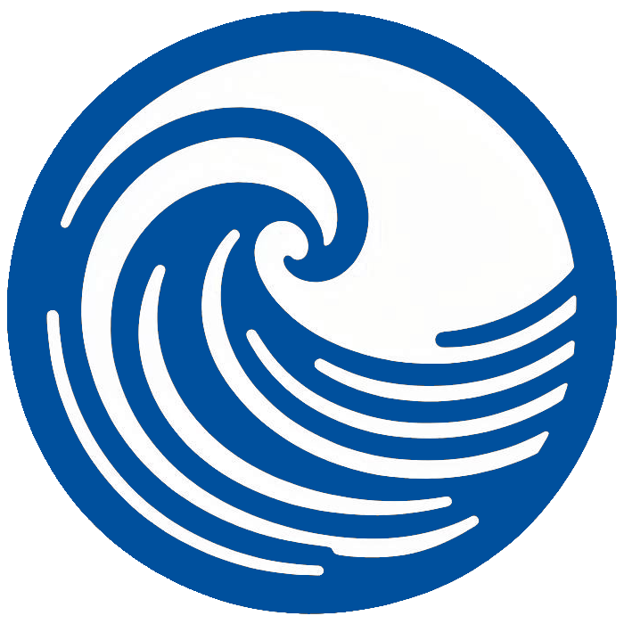

# Swell Forecast

<p align="center">
  
</p>

This project provides a Home Assistant HACS integration to display a 7 day forecast for beach swells using [Surfline](https://www.surfline.com) data.

## Features

A sensor is created with forecasts the next 7 days with data like: 

- `Probability` = Percentage probability/accuracy
- `SurfMinFt` = Minimum surf height in feet 
- `SurfMaxFt` = Maximum surf height in feet 
- `SurfMinM` = Minimum surf height in meters 
- `SurfMaxM` = Maximum surf height in meters 
- `SurfPower` = The power of the swell
- `OptimalScore` = The wave score
- `HumanRelation` = The human relation measurement
- `ForecastDate` = The date of the forecast

## Installation

- In `HACS` > `3 dots` > `Custom Repositories`.
- In `Repository` add: `https://github.com/mrvautin/hacs-beach-swell-forecast`
- In `Type` select `Integration`
- Click `Add`

Once installed select `Settings` > `Devices and services` > `ADD INTEGRATION` > Search for `Beach Swell Forecast`

In `Swell location name` enter a name which is appropriate to the location - `Kirra Qld Australia`. 

> Note: it will be used to name the sensors 

In `Swell location Id` you will need to locate the Id for your Swell. 

1. Visit: https://www.surfline.com/surf-report/broadbeach/584204204e65fad6a77092d3
2. Search for the name of your Swell
3. Grab the Swell Id for your chosen swell from the URL bar. Eg: https://www.surfline.com/surf-report/<name of beach>/<swell id>

> The Swell Id section is all we need here. One example for Broadbeach Australia is: 584204204e65fad6a77092d3

## Usage

There are many ways to display the swell data. One possible way is to use an `entites` card which is able to 
display attributes. 

``` yaml
title: Kirra Australia
type: entities
entities:
  - entity: sensor.<location_name>_day1_forecast
    name: Date
    icon: mdi:calendar
  - entity: sensor.<location_name>_day1_forecast
    type: attribute
    name: Probability
    attribute: probability
    icon: mdi:percent
  - entity: sensor.<location_name>_day1_forecast
    type: attribute
    name: Human Relation
    attribute: humanRelation
    icon: mdi:human
  - entity: sensor.<location_name>_day1_forecast
    type: attribute
    name: Max height feet
    attribute: surfMaxFt
    icon: mdi:wave-arrow-up
  - entity: sensor.<location_name>_day1_forecast
    type: attribute
    name: Min height feet
    attribute: surfMinFt
    icon: mdi:wave-arrow-down
  - entity: sensor.<location_name>_day1_forecast
    type: attribute
    name: Wave score
    attribute: optimalScore
    icon: mdi:wave
```

## Contributing

Contributions are welcome! Please fork the repository and create a pull request with your changes.

## License

This project is licensed under the MIT License. See the [LICENSE](LICENSE) file for details.
